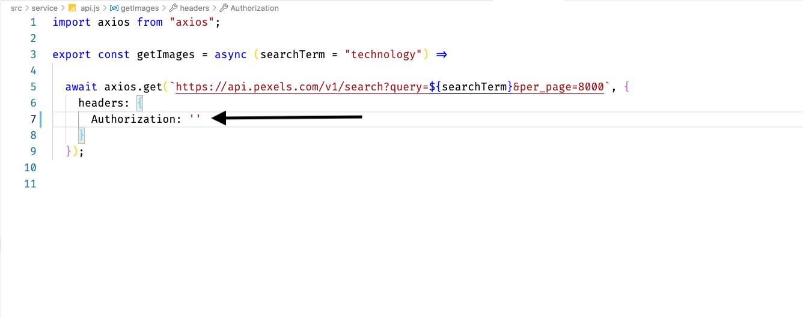
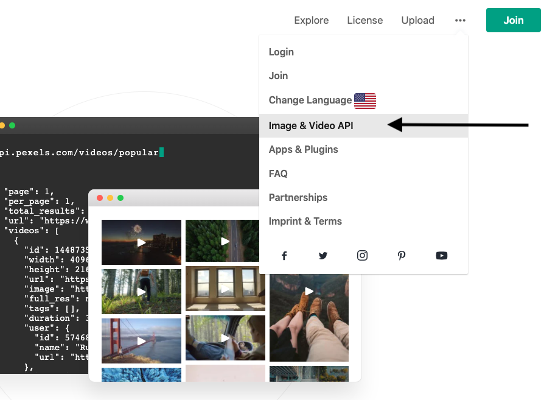

<h1 align="center">Pexler</h1>

 
Acesse a versão que foi hospedada na Netlify aqui: <a href="https://pexler.netlify.app/" target="_blank">Pexler</a>
   
   
</img>
 

Projeto <strong>de Galeria de Foros </strong> desenvolvido com ReactJS

## Instalação

1) Obtenha a  chave em https://www.pexels.com/login/ para logar/se cadastrar e depois vá em "Image & Video API":

 
</img>
 

2) Cole a chave no arquivo "api" que fica na pasta "service"
 
</img>
 
3) Use yarn ou npm install para instalar as dependências

4) Use yarn start ou npm start para rodar a aplicação

## O que foi usado:

1) Context api(gerenciador de estado);
2) Paginação;
3) react-router-dom;
4) axios;

## 

Você pode baixar a imagem original, acessar o link dela no site da Pexels e  acessar o link do artista.

Você também pode acessar uma versão que foi hospedado na Netlify: https://pexler.netlify.app/

